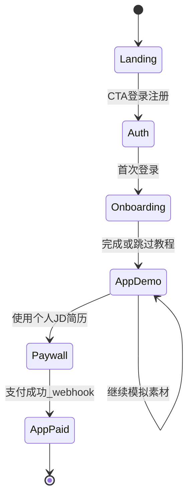

# 稿定面试 · InterviewScript — 产品需求文档（PRD）

> 对外品牌：**稿定面试**（中文）· **InterviewScript**（英文）。  
> 竞品调研、定价与详细交互畅想见附录：[竞品核心数据及我们产品核心亮点（调整版）.md](./竞品核心数据及我们产品核心亮点（调整版）.md)

---

## 1. 背景与目标

### 1.1 一句话价值

帮助求职者在时间紧、对岗位不熟的情况下，**合规、高效地完成面试逐字稿准备**（JD/简历理解 → 高质量问题 → AI 对话打磨 → 可编辑成稿与导出）。

### 1.2 产品目标

- **网页端为主**：完整三栏工作流；**手机端**以查看、轻编辑、导出为主。  
- **上线即双语**：中文 / English UI、教程、邮件与支付说明一致可维护（i18n key 管理，禁止双份硬编码页面）。

### 1.3 非目标（明确不做）

- 不提供**考场实时代答、语音偷听、屏幕共享作弊**等违规能力。  
- 不做通用刷题、大规模模拟考试平台、与「临时逐字稿准备」无关的冗余功能。

### 1.4 合规与审核口径（法务 / 商店 / 对外文案）

- **能做什么**：面试**前**准备阶段的材料辅助——解析 JD、梳理简历要点、生成/整理练习题与回答思路、输出用户可编辑的逐字稿。  
- **不能做什么**：不宣称、不实现「面试进行中实时提示答案」等可能被认定为作弊的功能。  
- 用户协议与首次引导末尾需展示**中英文**各一份简短「使用边界」说明；设置页可再次查看。

---

## 2. 用户与核心场景

### 2.1 用户画像（摘要）

海投、临时面试通知多、焦虑、希望少操作、重视合规与性价比。详见附录原文档「核心用户画像」。

### 2.2 核心场景

用户接到某岗位面试通知 → 需快速得到**贴合该 JD 与本人简历**的逐字稿 → 通过 AI 多轮对话细化 → 导出 Markdown / 移动端查看。

---

## 3. 功能范围

### 3.1 MVP

| 模块 | 说明 |
|------|------|
| 账号 | 注册 / 登录（邮箱或 OAuth 二选一即可，具体实现阶段选型） |
| 模拟体验 | 官方模拟 JD + 模拟简历，**功能不阉割**，引导完整走通 |
| 第 0 页 | 设置与前析合一页：左侧**完整简历**；右侧 JD、**简历–JD 匹配度**、AI 分析结论、轮数与问题比例等；详见 **§3.1.1** |
| 生成问题 | 生成约 20 题（可按比例）；**显式承接 §3.1.1 的分析结论**；进入核心操作区 |
| 三栏工作台 | **顶栏轮次 Tab**（第 0 页 + 一面/二面/…）+ **左/中/右联动**；左栏工具与列表顺序见 **§3.1.2** |
| 官网与资产 | 首页含**会员购买**与**分享得次数**说明/入口；登录后 **「我的逐字稿」** 管理多份 JD 项目，见 **§3.1.3** |
| 付费墙 | 使用**个人**简历/JD 解析前拦截；价格策略与附录一致（如：按次 JD 解析、季度会员、无限档） |
| 新手教程 | 分步遮罩引导（可跳过、可重放），见 [docs/DESIGN.md](./docs/DESIGN.md) |
| i18n | 全站 `zh` / `en`，URL 建议带 locale 前缀 |

### 3.1.1 第 0 页（设置 + 材料展示 + 前析：高价值入口）

第 0 页不是「几个字段的简表」，而是用户进入三栏工作台前的**主控台**：把**材料完整性、AI 前析、与后续问题生成的逻辑**放在同一屏，减少跳页与心理不确定感。

**布局原则（桌面优先）**

- **左侧主栏（简历）**  
  - 展示用户（或模拟体验）的简历**全文**，可滚动阅读，**禁止**仅用一两句摘要代替正文（摘要可作为折叠块辅助，但不能替代完整展示）。  
  - 若已做结构化解析，可在侧栏或简历顶部增加「已识别模块」标签（教育/经历/项目/技能等），与正文对照，增强信任感。

- **右侧主区（同屏整合，一块做完）**  
  - **JD**：岗位描述全文或可展开的摘要，与左侧简历**同时可见**，便于用户自己扫一眼对照。  
  - **简历与 JD 的匹配度**  
    - 展示**总览匹配度**（如分档或分数）及**分维度说明**（示例维度：硬性技能覆盖、经历与岗位相关性、可迁移能力、潜在缺口/风险点）。  
    - 必须附带**免责声明式说明**（中英文）：结果为模型基于文本的估算，**不代表用人单位或招聘方评价**，仅供面试准备阶段参考。  
  - **AI 前析结论**（与附录文档中的竞争力、优势、压力等叙述对齐，可产品化为固定模块）  
    - 例如：岗位侧重点、简历亮点、建议准备时加强的块、对「后续高频问题类型」的预判（文字短段落 + 可折叠细节）。  
  - **生成问题的前置配置（与右侧分析同页、同一视觉区块或紧邻）**  
    - 面试**轮数**（及与 Tab 的对应关系）。  
    - **问题类型比例**（简历深挖 / 业务熟悉 / 拓展思考 / 技术 / 业务等，与附录一致）。  
    - **附加要求**（侧重某类业务、避开某类问题、语言风格等）。  
  - 主按钮：**生成 N 个高质量问题**；按钮附近有一句**承接文案**，明确「将基于本页左侧简历、JD 及上述匹配度与分析结果生成问题」，让用户理解前后因果关系。

**等待与加载体验（必填）**

- JD/简历解析、匹配度与综合分析往往需数秒至十余秒，**禁止**只显示转圈无文案。  
- 采用 **「AI 思考过程适度披露」**（经产品化、脱敏后的展示，**非**原始 chain-of-thought 全文）：  
  - 形式可为**流式短句**或**分步状态卡片**（2～5 步轮换），示例方向：「正在对照 JD 与简历中的技能与关键词…」「正在归纳岗位核心考察维度…」「正在标记经历与 JD 的重合与缺口…」「正在对齐你设置的问题比例与后续生成侧重点…」。  
  - 文案需**短、像人话、可 i18n**；每步停留时间可与真实后端阶段大致对齐（或略快于实际，以体感流畅为准）。  
  - 目的：缓解等待焦虑，并让用户**预感到**接下来的 20 题会围绕什么，提升对生成结果的耐心与信任。

**与「生成问题」的衔接**

- 第 0 页产出的结构化结果（匹配度各维度、缺口、重点、用户配置的比例与附加要求）应作为**显式上下文**传入问题生成接口；PRD 层要求**可追溯**：用户在本页看到的要点，应能在生成的问题列表中有可感知呼应（不要求逐条一一对应，但不能完全无关）。

**移动端**

- 同一套数据与结论；布局改为**纵向堆叠**或 **Tab：简历 | 分析与设置**，避免窄屏同时挤三列导致简历无法完整阅读。完整简历仍以**可滚动全文**为准。

**埋点建议（补充）**

- 第 0 页停留时长、分析完成率、匹配度模块展开率、「生成问题」点击率；等待披露各步曝光次数（用于优化步数与文案）。

### 3.1.2 应用壳：最顶栏、轮次 Tab 与三栏交互

本节约定**网页端主路径**；移动端保留同一套信息架构，三栏改为 Tab/抽屉（见 DESIGN）。

#### 最顶栏（全局 Chrome）

自左向右建议分区（可合并项，但信息需可达）：

| 区域 | 内容 |
|------|------|
| 左 | 产品 Logo / 名称；可选「返回官网」或「我的逐字稿」快捷入口（与 §3.1.3 同一目的地） |
| 中 | **轮次 Tab 栏**（占顶栏主体宽度，可横向滚动） |
| 右 | **语言切换**；**购买会员 / 升级**（主 CTA 或入口按钮）；**分享得次数**（图标+文案，点击展开规则与分享操作）；**用户菜单**（头像下拉：账户、**我的逐字稿**、设置/教程重放、合规说明、退出） |

- **购买会员**、**分享得次数**须在未登录态（官网）与已登录态（应用顶栏）均有一条清晰路径，避免用户找不到付费与裂变规则（具体权益与附录增长策略一致）。

#### 轮次 Tab 与「第 0 页 / 第 1～N 页」对应关系

- **第 1 个 Tab — 第 0 页**：对应 §3.1.1（简历全文 + JD + 匹配度 + 分析 + 轮数/比例/附加要求 + 生成问题）。**不采用**核心三栏布局，而为该页专属的双栏/堆叠布局。  
- **后续 Tab — 面试轮次**：名称默认 **一面、二面、三面**…（i18n：`Round 1` / `一面` 等）。  
- **Tab 数量**：由第 0 页用户设置的**面试轮数 N** 决定，共 **1（第0页）+ N** 个 Tab；改轮数后 Tab 动态增减，**每个轮次 Tab 拥有独立的问题列表与对话上下文**（附录：各轮提示词不同），但**右侧逐字稿**为**全局汇总**（跨轮次、按题顺序展示，见下）。  
- **当前 Tab 切换**：切换轮次时，**左栏**展示该轮次下的问题列表；**中栏**展示该轮次下**当前选中题**的对话；**右栏**仍为**全局逐字稿**（不随 Tab 清空），可选「仅看当前轮」筛选（V1 可做，MVP 可仅全局视图 + 题号标明轮次）。

#### 左栏：截图解析、新建问题与问题列表（顺序与结构）

- **顺序（桌面与左栏抽屉内保持一致）**：  
  1. **上方**：**截图解析入口** + **新建问题**，同一**紧凑工具区**（并排按钮或「工具条」），固定在左栏**顶部**（列表滚动时工具区**吸顶**或始终可见），避免用户滚到列表底部才看到能力。  
  2. **下方**：**可滚动的问题列表**（当前轮次下的题目），每条展示标题摘要、完成状态（未开始 / 进行中 / 已完成）、可选轮次/序号标签。  
- **截图解析**：上传或粘贴图片 → 解析出的题目**加入当前轮次**的问题列表（去重策略产品另定）。  
- **新建问题**：手动输入标题/题干 → 加入当前轮次列表，与中栏、右栏的联动规则与普通题一致。

#### 三栏联动规则（核心交互）

| 用户操作 | 左栏 | 中栏 | 右栏（全局逐字稿） |
|----------|------|------|---------------------|
| 点击某一题 | 该项高亮为「当前题」 | **切换**为该题**独立对话线程**（历史消息仅对应该题；切换题即切换上下文） | **滚动定位**到该题对应段落，并**短暂高亮**；若该题尚无成稿，显示占位提示（可引导去中栏对话） |
| 在中栏发送消息 / 确认答案 | 不变（可选同步该题状态为进行中） | 追加对话 | 该题对应段落**实时更新**（或合并进全局稿） |
| 在右栏编辑某题段落 | 不变 | 可选：标记该题「稿已手动改过」或与对话区提示轻量同步（MVP 可只做右栏编辑落库） | 用户可直接改 Markdown 文本 |
| 切换顶栏轮次 Tab | 列表切换为另一轮题目；**当前题**重置为该轮第一题或上次记忆 | 对话区切换为该轮当前选中题 | 右栏仍为全局稿；可选筛选当前轮 |

- **记忆**：每个轮次内记住用户**最后选中题目**；从第 0 页生成问题进入某轮时，默认选中第一题。  
- **空列表**：当前轮尚无题时，左栏展示空状态 + 引导「回到第 0 页生成」或「截图解析 / 新建」。

#### 问题列表补充细节

- 列表项可**展开/收起**以查看纲要（与附录一致）；**点击行主体** = 选中该题并触发上表联动；展开仅影响左栏展示，不改变中栏除非选中发生变化。  
- **导出 Markdown**：建议放在**右栏底部**或顶栏用户区，导出范围为**全局逐字稿**（含各轮），文件名可带 JD 简称与日期。

### 3.1.3 官网、「我的逐字稿」与会员 / 分享入口

#### 官网（Landing，未登录或可浏览）

- **价值区**之外，需有固定模块：**定价 / 购买会员**（套餐与附录一致：按次、季度、无限等），CTA 至登录后结账或 Stripe/国内支付页。  
- **分享得次数**：独立小块说明规则（例：分享至小红书/抖音截图审核、邀请好友付费双方获赠等，**具体以运营为准**），并提供「参与」入口（未登录引导注册）。  
- 与 §3.1.2 顶栏入口**文案与规则一致**，避免官网与应用内两套说法。

#### 「我的逐字稿」（我的文件 / 项目库）

- **定义**：用户账号下，**每一个 JD（或每一次「面试准备项目」）**对应一条记录，内含第 0 页材料、各轮问题、对话与**聚合逐字稿**，类似 Notion 的「所有页面」或网盘中的**按项目归档**。  
- **入口**：官网登录后跳转默认页可为该列表；应用内顶栏 **用户菜单 → 我的逐字稿**；可选左侧窄边栏「全部项目」（实现阶段二选一，PRD 要求**至少一处全局入口**）。  
- **列表信息**：项目名称（建议：**公司 + 岗位** 或 JD 首行摘要）、关联简历标识、**更新时间**、进度（如 已完成题数 / 总题数）、状态标签（草稿 / 已定稿）。  
- **操作**：点击进入该项目的**应用壳**（恢复第 0 页 + 各轮 Tab 与三栏数据）；支持**新建项目**（新 JD）、**复制**（V1）、**删除**与导出记录（删除需二次确认）。  
- **移动端**：以卡片列表为主，点击进入同项目工作区。

#### MVP 与分期

- **MVP**：「我的逐字稿」**列表 + 进入项目 + 新建项目**为必须；分享激励若后端未就绪，**官网与顶栏仍展示规则与占位参与流程**（或先记录工单人工核销），避免界面缺失。  
- **V1**：分享邀请自动核销、重复问题跨项目复用等见 §3.2。

### 3.2 V1（MVP 之后）

- 重复问题标签与复用统计  
- 分享裂变与邀请权益（与附录增长策略一致）  
- PWA：离线查看已生成逐字稿（可选）  
- 国内微信/支付宝支付（需主体与资质，与 Stripe 分区域）

### 3.3 附录引用指标

成功标准、数据埋点、增长与付费细节以附录文档「定义成功的标准」「数据埋点」「增长策略」为准；PRD **补充**以下埋点：

- 新手教程：每步完成率、跳过率、重放次数  
- 付费漏斗：弹窗展示 → 发起支付 → 支付成功 → 权益生效  

---

## 4. 关键页面与状态机

- **Landing**：价值主张 + 演示 + 「用模拟 JD 免费体验」CTA。  
- **Onboarding**：交互式教程（与 DESIGN 文档步骤一致）。  
- **AppDemo / AppPaid**：同一套三栏应用壳；后端根据权益字段区分模拟 vs 正式解析能力。

---

## 5. 国际化（i18n）

| 项 | 规则 |
|----|------|
| 默认语言 | `Accept-Language`，可手动切换并持久化 |
| URL | 建议 `/[locale]/...`，locale ∈ `zh`, `en` |
| AI | 系统提示与用户所选语言一致；JD/简历保留原文；逐字稿生成语言可配置，默认与用户 UI 语言一致 |
| 模型路由 | 见 **§8.2**：国内流量走 DeepSeek，海外走 Gemini；与「数据处理区域 / 账单地区」策略对齐 |
| 合规文案 | `compliance.short.zh` / `compliance.short.en` 分 key 维护 |

---

## 6. 支付与区域策略

| 区域 | 渠道 | 说明 |
|------|------|------|
| 中国大陆 | 微信支付、支付宝 | 需企业主体、ICP 等；可选用直连或聚合服务商，本仓库提供接口占位与配置说明 |
| 海外 | Stripe | Checkout 或 Payment Element；价格可用 USD 等，与 SKU 映射 |

**区域判断（定一种主策略，避免误展示）**：以用户**手动选择账单地区**为主，注册手机号 / IP 为辅；支付页仅展示当前区域可用方式。

**权益唯一可信源**：支付渠道 **webhook** 服务端验签成功后，写入订单与权益（次数、会员到期）；前端仅展示缓存状态。

---

## 7. 非功能需求

| 类别 | 要求 |
|------|------|
| 性能 | 首屏可交互；对话流式输出 |
| 无障碍 | 关键按钮有 label；对比度符合基础规范 |
| 数据与隐私 | 简历/JD 加密存储、用户可删除数据；最小权限原则 |
| 审计 | 付费事件、权益变更、关键 AI 调用可追踪（内部） |

---

## 8. 技术实现约定（与仓库代码对齐）

### 8.1 框架与基础设施

- **框架**：Next.js App Router + TypeScript + Tailwind。  
- **部署**：**Vercel** 作为首选托管（Edge/Serverless 与预览环境便于独立开发者迭代）；数据库若用 PostgreSQL 可选用 Vercel 生态兼容的托管库（如 Neon）或自建，按合规与延迟选型。  
- **i18n**：`next-intl`。  
- **数据**：Prisma；本地可用 SQLite，生产建议 PostgreSQL。  
- **支付**：海外 **Stripe**（Checkout / Webhook 开通权益）；中国大陆 **微信 / 支付宝**（直连或服务商，与 §6 一致）。实现代码计划落在仓库 `web/` 目录下的 API Routes（具体路径随脚手架生成）。

### 8.2 AI 提供商（分区域）

| 用户/数据处理区域 | 默认模型提供商 | 说明 |
|------------------|----------------|------|
| 中国大陆（国内用户、数据不出境场景） | **DeepSeek** | 使用官方 API（常见为 OpenAI 兼容接口）；提示词与输出语言仍遵循 §5 |
| 海外及其他 | **Google Gemini** | 使用 Gemini API；注意配额、地区可用性与服务条款 |

**路由原则**：默认与用户在 **账单地区** 或单独选择的 **数据处理区域** 一致（与支付区域策略对齐），避免误把含简历/JD 的请求发到错误司法辖区的模型端点；若仅做 UI 语言 `zh/en` 切换而不代表数据出境意愿，则**不得以 UI 语言单独作为唯一路由条件**。  
**工程要点**：API Key 分环境变量管理（如 `AI_PROVIDER_CN`、`DEEPSEEK_API_KEY`、`GEMINI_API_KEY`）；服务端聚合调用，**禁止**把密钥暴露给浏览器。

---

## 9. 文档索引

| 文档 | 内容 |
|------|------|
| [docs/DESIGN.md](./docs/DESIGN.md) | Notion 风设计 tokens、布局线框、新手教程分步文案（含 i18n key） |
| [竞品核心数据及我们产品核心亮点（调整版）.md](./竞品核心数据及我们产品核心亮点（调整版）.md) | 竞品、差异化、埋点原文、界面表格与流程图 |

---

*文档版本：与实现计划同步；变更请更新本文件与 DESIGN 文档。*
