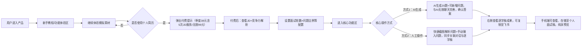

# 竞品核心数据及我们产品核心亮点（调整版）

## 一、6类核心竞品核心数据表格（社媒、下载、价格、付费点）

|**竞品名称**|**社媒数据（2026.3.21 官方账号核实）**|**真实下载量（应用商店+七麦数据）**|**真实定价（官方标注）**|**核心付费点**|
|---|---|---|---|---|
|白瓜面试|小红书3200+、抖音6500+，无知乎账号|15-20万|点数计费（300点=30元），语音3点/分钟、AI答题50点/次、模拟面试200点/场|面试实时辅助（语音识别、AI答题），点数补充|
|刷刷题APP|小红书1.1万+、抖音2.8万+、知乎1.9万+|80-100万|自定义题库9.9元/月、班级刷题19.9元/月、模拟考试15元/次|自定义题库、模拟考试分析、题库解锁|
|随身鹿|小红书2.7万+、抖音5.9万+，无知乎账号|120-150万|会员68元/月、198元/季，解锁高级转写、多模板|无广告、高级录音转写、多场景复盘模板、Markdown导出|
|面试精灵|小红书1800+、抖音2600+，无知乎账号|30-40万|会员68元/月、168元/季、588元/年，单次模拟面试15元/场|AI模拟面试、简历定制、无限次语音识别演练|
|多面鹅|小红书900+、抖音1700+，无知乎账号|10-15万|会员78元/月、218元/季|AI模拟面试、实时答题反馈（逻辑、表达评分）|
|即答侠|小红书4000+、抖音2500+，无知乎账号|25-35万|高级答案99元/月、简历优化299元/次、一对一指导199元/小时|高级面试答案定制、人工简历优化、一对一面试指导|
## 二、产品定义

**我们产品核心差异化（与竞品核心区别）**
1.  合规性突出：我们产品正规合规，仅帮助用户快速准备面试逐字稿、了解面试重点，不涉嫌任何作弊；反观多数竞品，存在违规作弊相关服务，风险较高。
2.  提示词更优质：专属AI提示词优化更到位，无需用户自行准备，搭配“擅长挖掘多岗位问题”的AI人格，适配性更强。
3.  垂直聚焦无冗余：不服务于刷题、模拟复盘等无关环节，精准聚焦“临时遇到岗位、需快速准备面试逐字稿”的核心需求，全流程围绕逐字稿准备，让用户快速做好准备、从容应对面试。

### 1. 产品定位

面向所有有面试准备需求的求职者（以海投人群为主，覆盖应届生、职场跳槽者），垂直聚焦「临时面试逐字稿快速准备」这一核心场景，不涉及刷题、模拟复盘等无关环节，核心价值是帮助用户在时间紧张、对岗位不熟悉的情况下，合规、高效地完成面试逐字稿准备，规避同类产品违规作弊的风险，打造“临时面试准备专属工具”。

### 2. 核心用户画像

核心用户为有面试焦虑情绪、缺乏充足准备时间、以海投为主（对部分目标岗位不熟悉）的求职者，具体特征：

- 核心痛点：面试准备时间紧、对部分岗位业务不了解、面对简历拷打和岗位相关问题无从下手、担心同类产品违规风险；

- 行为特征：海投多个岗位，常临时接到面试通知，需要快速准备逐字稿，不愿花费过多时间在复杂操作上；

- 需求偏好：追求操作便捷、功能实用，拒绝复杂规则，重视合规性和性价比，希望避免重复准备同类面试问题。

### 3. 定义成功的标准（分阶段，适配独立开发者，低门槛可落地）

- **初期（上线1个月）**：核心功能（截图解析、AI对话、逐字稿生成、重复问题标签化）正常运行，无严重bug；累计付费用户≥50人，付费率≥8%（按体验用户基数计算）；用户好评率≥90%，无负面反馈。

- **中期（上线3-6个月）**：小红书/抖音累计曝光≥1万，流量初步起量；付费率稳定在10%-15%；分享邀请机制落地且有效；核心数据埋点指标达标；用户复购率≥30%。

- **长期（上线6个月以上）**：实现盈利（营收覆盖成本）；累计付费用户≥500人，付费率稳定在15%以上；形成“临时面试逐字稿准备”的差异化口碑，成为该细分领域用户优选工具。

### 4. 数据埋点（可量化、可追踪，聚焦核心体验）

- 问题满意度：用户对AI生成问题的认可度≥80%（通过用户点击“满意”按钮统计，核心衡量AI问题贴合度）；

- 对话深度：平均单问题AI对话轮数≥5轮（体现用户交互充分度，衡量AI对话的实用性）；

- 重复问题利用率：重复问题标签化后，用户复用率≥60%（衡量重复问题标签功能的价值，减少用户无效准备）；

- 功能使用率：截图解析功能使用率≥70%、逐字稿导出使用率≥60%（衡量核心功能的实用性和用户需求匹配度）；

- 转化指标：免费体验用户转付费率≥8%，分享邀请转化率≥5%（衡量增长策略和产品价值认可度）。

### 5. 增长策略（贴合独立开发者，低成本、易落地）

- 分享激励：用户分享产品至小红书/抖音，可免费解锁1次JD解析；成功邀请好友付费，双方各赠送1次JD解析体验，低成本实现用户裂变；

- 付费模式：主打“按次+季度”混合付费，降低用户决策门槛——JD解析9.9元/次、季度会员38元（含5次JD解析+无限逐字稿生成），无复杂规则和隐形消费；

- 产品优化：重点追踪数据埋点指标，根据用户反馈持续优化AI提示词、问题生成逻辑和操作流程，提升核心体验；

- 差异化宣传：突出“合规无作弊、临时面试逐字稿快速准备”的核心优势，区别于同类违规产品，吸引担心违规风险的用户。

## 三. 产品最突出的体验及付费体验感是什么？（核心：C端爽感+高性价比）

- 操作极简省心：支持截图一键解析加入问题列表、多图存储，全流程引导，无需手动复杂操作，小白也能快速上手，一站式完成JD解析到逐字稿优化。

- 免费体验友好：新用户可使用模拟简历，完整体验所有功能（无功能阉割），充分感受产品价值后再决定付费，无体验压力。

- 付费规则朴素：仅2种会员（38元季度含5个JD/99元无限），无复杂规则、无隐形消费，性价比远超竞品，按需选择即可。

- 适配性极强：AI人格贴合多岗位，支持记忆同步，逐字稿可编辑、可导出，手机端可纯享查看存储，兼顾便捷性与实用性。

## 四、产品用户使用流程畅想（横向简洁流程图）

核心逻辑：以横向流程呈现，简洁明了，贴合用户使用路径，重点突出新手体验、付费节点、核心功能及成果使用，适配飞书展示，具体流程如下：

核心逻辑：贴合用户“临时接到面试、无准备、想快速搞定逐字稿”的真实场景，重点呈现交互界面布局，采用表格模拟界面结构，清晰区分各区域功能，补充0页AI生成设置、4个默认tab、三栏交互等核心细节，兼顾专业性和C端操作爽感，具体界面布局及说明如下：

### 界面整体布局（表格模拟，精准还原畅想）

说明：默认分为「第0页（AI生成设置页）」和「核心操作页（4个默认tab）」，核心操作页采用三栏布局，所有问题记忆同步，单个问题独立对话、独立展示，具体布局如下：

#### 1. 第0页：AI生成问题前置设置页

|**第0页 - AI生成问题前置设置（用户进入核心操作前）**|||
|---|---|---|
|基础设置|设置选项|说明|
|面试面数|可手动输入/AI预判（默认：3面，对应3个tab）|生成对应数量的面试tab，默认4个tab（含初始设置页）|
|问题比例设置|1. 简历拷打比例2. 业务熟悉程度比例3. 拓展独立思考比例4. 技术考察比例5. 业务考察比例|用户可自由调节，AI按比例生成20个高质量问题（免费体验仅支持模拟JD设置，个人JD解析需付费解锁）|
|附加要求|可输入自定义要求（如“侧重某类业务、避开某类问题”）|AI生成问题时贴合用户自定义需求|
|简历&JD展示|展示用户上传的简历+JD关键信息|同步显示之前的通过率、竞争压力、优势分析（免费体验仅支持官方准备的模拟简历，使用个人简历、解锁JD解析需购买会员）|
|点击「生成20个高质量问题」，进入核心操作页（4个tab）|||
#### 2. 核心操作页（默认4个tab：第0页设置+一面+二面+三面）

|**顶部Tab栏（4个默认）：** 第0页设置 → 一面 → 二面 → 三面（切换tab，对应不同面试阶段，AI提示词不同）
      |||
|---|---|---|
|**最左侧：问题列表区**|**中间：AI无限对话区** **（下方随时显示对话风格模式和搜索与否）**|**最右侧：逐字稿全局成品区** **（可以编辑）**|
|1. 显示当前tab下的20个高质量问题（按设置比例排序） 2. 每个问题独立显示，可点击展开/收起，可以看到对话答案的纲要 3. 点击某一个问题，中间对话区同步显示该问题的专属对话（类似追踪那个答案在ai无限对话区的位置） 4. 标注问题完成状态（未开始/进行中/已完成） 0. 用户剪贴板-图片截图无限解析、用户自己新建问题|1. 点击左侧问题后，显示该问题的AI对话界面（独立对话窗口） 2. 支持与AI无限对话，完善该问题的回答思路，然后有交互按钮，确认该答案 3. 所有问题的对话记忆同步（AI记住用户所有回答逻辑、个人特点） 4. 对话实时同步到右侧逐字稿对应位置|1. 实时展示所有问题的逐字稿成品（全局汇总） 2. 对应左侧问题，逐字稿按问题顺序排列，标注对应问题序号 3. 可直接编辑逐字稿内容，编辑后同步关联中间对话区（免费体验仅支持模拟简历生成内容，使用个人简历需付费） 4. 底部有「导出Markdown」按钮|

> （注：文档部分内容可能由 AI 生成）